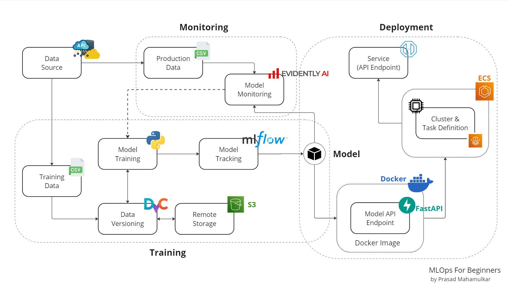

# Insurance Cross Sell Prediction 🏠🏥

## Diagram
Below is the architecture diagram that illustrates the flow of the project from data ingestion to model deployment:



#### 1. Set Up the Environment
Ensure you have Python 3.8+ installed. Create a virtual environment and install the necessary dependencies:
```bash
python -m venv venv
source venv/bin/activate  # On Windows: venv\Scripts\activate
pip install -r requirements.txt
```
Alternatively, you can use the Makefile command:
```bash
make setup
```
#### 2. Data Preparation
Pull the data from DVC. If this command doesn't work, the train and test data are already present in the data folder:
```bash
dvc pull
```

#### 3. Train the Model
To train the model, run the following command:

```bash
python main.py 
```
Or use the Makefile command:

```bash
make run
```
This script will load the data, preprocess it, train the model, and save the trained model to the models/ directory.

#### 4. FastAPI
Start the FastAPI application by running:

```bash
uvicorn app:app --reload
```

#### 5. Docker
To build the Docker image and run the container:

```bash
docker build -t my_fastapi .
```
```bash
docker run -p 80:80 my_fastapi
```
Once your Docker image is built, you can push it to Docker Hub, making it accessible for deployment on any cloud platform.
#### 7. Monitor the Model
Integrate Evidently AI to monitor the model for data drift and performance degradation:

```bash
run monitor.ipynb file
```
